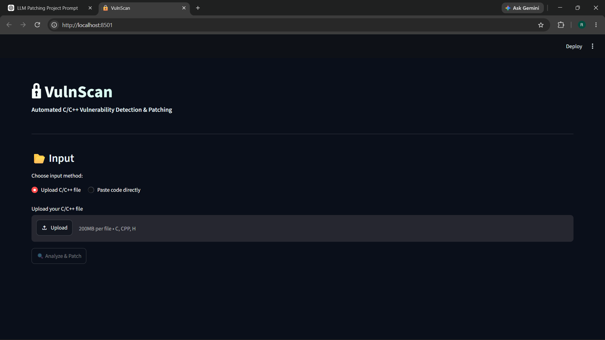
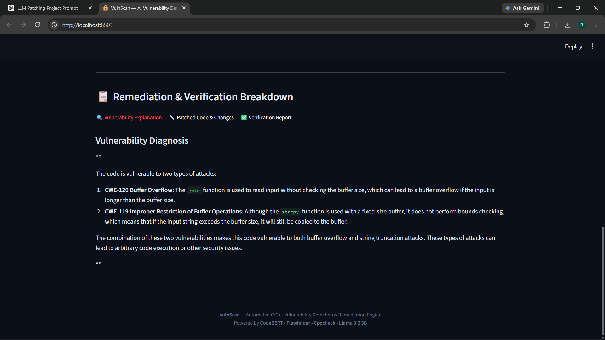
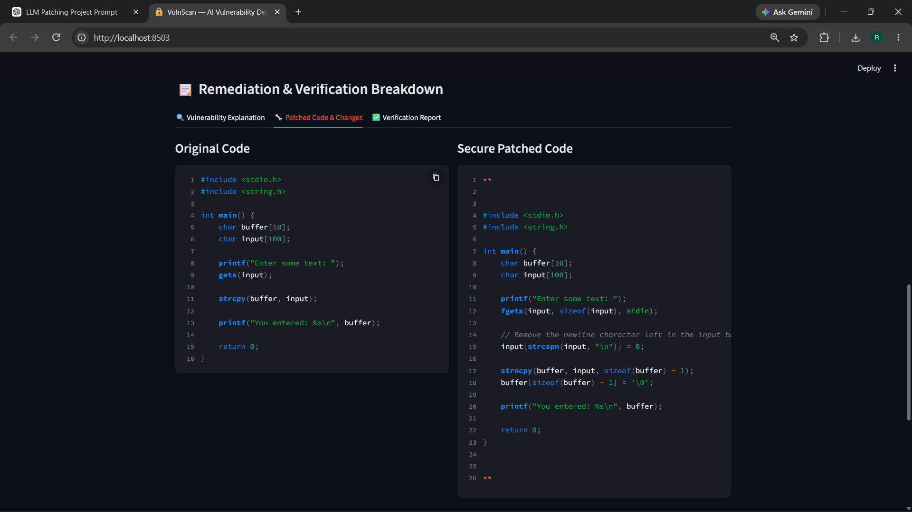
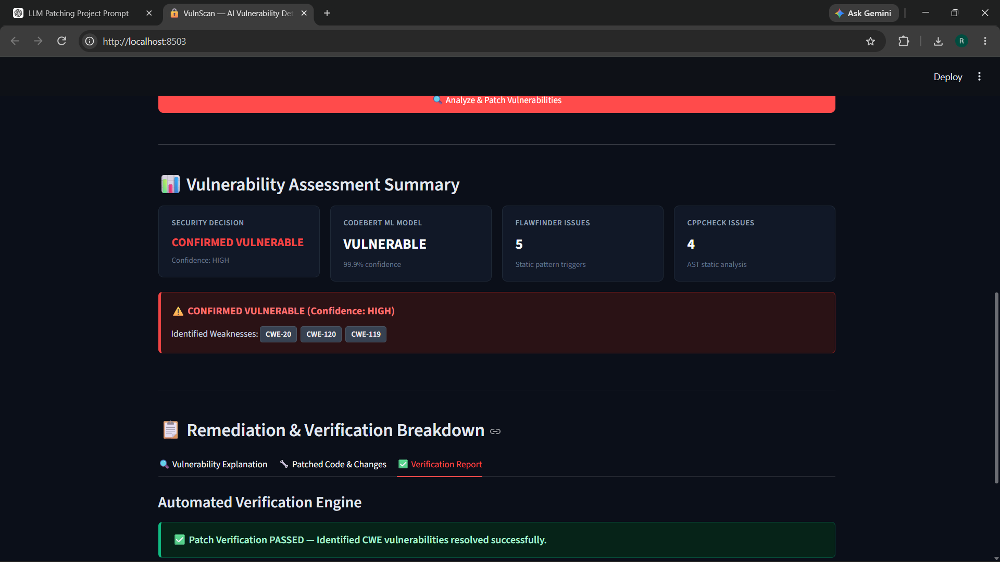

# 🔐 VulnScan

### Automated C/C++ Vulnerability Detection & AI-Assisted Patching

VulnScan is an end-to-end security analysis tool for detecting vulnerabilities in C/C++ source code, identifying relevant CWE categories, generating AI-assisted patches, and verifying the resulting code using static analysis.

The system combines **CodeBERT-based vulnerability classification**, **Flawfinder**, **Cppcheck**, and a **locally running Llama 3.2 3B model through Ollama** into a single analysis and remediation pipeline.

---

## ✨ Features

- 🔍 **ML-based vulnerability detection** using CodeBERT
- 🛡️ **Static security analysis** with Flawfinder
- 🔎 **Static analysis** with Cppcheck
- 🧠 **Hybrid vulnerability decision** combining ML and static-analysis evidence
- 🏷️ **CWE identification** from static-analysis findings
- 🤖 **Local LLM-based patch generation** using Llama 3.2 3B
- 🔧 **Automated vulnerability remediation**
- ✅ **Patch verification** using Cppcheck
- 📊 Interactive **Streamlit dashboard**
- 📁 Supports **C, C++, and header files**
- 🔒 LLM inference runs locally through **Ollama**

---

## 🚀 Live Demo

**[Try VulnScan Live](https://vulnscan-6dqwmexccvc3u7qln7kgmu.streamlit.app/)**

The deployed portfolio demo provides:

- CodeBERT vulnerability detection
- Flawfinder static analysis
- Cppcheck static analysis
- CWE identification
- Vulnerability assessment dashboard
- Patch-generation status and verification reporting

> **Cloud Demo Limitation:** AI patch generation uses Ollama with Llama 3.2 3B locally. Ollama is not available in the Streamlit Cloud environment, so AI patch generation and patch verification are skipped in the public demo when no patched code is generated.

### Local Full Pipeline

For the complete VulnScan experience, run the project locally with Ollama:

```text
C/C++ Source
      ↓
CodeBERT Detection
      ↓
Flawfinder + Cppcheck
      ↓
CWE Identification
      ↓
Llama 3.2 3B via Ollama
      ↓
AI-Generated Patch
      ↓
Cppcheck Verification

```

## 🏗️ System Architecture

VulnScan follows a multi-stage detection and remediation pipeline:

```text
┌──────────────────────┐
│    C / C++ Source    │
│  Upload or Paste     │
└──────────┬───────────┘
           │
           ▼
┌──────────────────────┐
│       CodeBERT       │
│ Vulnerability Model  │
└──────────┬───────────┘
           │
           ▼
┌──────────────────────────────┐
│       Static Analysis        │
│                              │
│   Flawfinder + Cppcheck      │
└─────────────┬────────────────┘
              │
              ▼
┌──────────────────────┐
│   Hybrid Decision    │
│   + CWE Extraction   │
└──────────┬───────────┘
           │
           ▼
┌──────────────────────┐
│    Prompt Builder    │
│  Structured Context  │
└──────────┬───────────┘
           │
           ▼
┌──────────────────────┐
│     Llama 3.2 3B     │
│       Ollama         │
└──────────┬───────────┘
           │
           ▼
┌──────────────────────┐
│    Generated Patch   │
└──────────┬───────────┘
           │
           ▼
┌──────────────────────┐
│  Patch Verification  │
│      Cppcheck        │
└──────────┬───────────┘
           │
           ▼
┌──────────────────────┐
│ Security Assessment  │
│   + Patch + Report   │
└──────────────────────┘
```

---

## 🔄 How It Works

### 1. Input

Users can either:

- Upload a C/C++ source file
- Paste source code directly into the interface

Supported extensions:

```text
.c
.cpp
.h
```

### 2. ML Vulnerability Detection

CodeBERT analyzes the source code and predicts whether it contains insecure code.

The project uses:

```text
mrm8488/codebert-base-finetuned-detect-insecure-code
```

The model provides:

- Vulnerability classification
- Confidence score

### 3. Static Analysis

VulnScan uses two complementary static-analysis tools.

**Flawfinder**

Detects potentially dangerous C/C++ functions and security-sensitive patterns.

**Cppcheck**

Performs static analysis and identifies potential programming and security issues.

### 4. Hybrid Vulnerability Decision

VulnScan combines evidence from multiple detection sources:

```text
CodeBERT Prediction
        +
Flawfinder Findings
        +
Cppcheck Findings
        ↓
Hybrid Security Decision
```

This provides additional evidence instead of relying solely on the ML model.

### 5. CWE Identification

Static-analysis findings are processed to identify relevant CWE categories associated with detected vulnerabilities.

Example:

```text
CWE-119
CWE-120
CWE-20
```

### 6. AI-Assisted Patching

When a vulnerability is confirmed, VulnScan constructs a structured remediation prompt containing the relevant source code and security findings.

The prompt is sent through:

```text
Ollama
   ↓
Llama 3.2 3B
```

The model generates:

- Vulnerability explanation
- Patched source code
- Description of changes

### 7. Patch Verification

The generated patch is passed through the verification stage.

Cppcheck is used to check the patched source for remaining relevant issues.

The application then reports the resulting remediation status.

---

## 🛠️ Tech Stack

| Component | Technology |
|---|---|
| Frontend / UI | Streamlit |
| Programming Language | Python |
| ML Model | CodeBERT |
| ML Framework | Hugging Face Transformers |
| Security Analysis | Flawfinder |
| Static Analysis | Cppcheck |
| LLM Runtime | Ollama |
| LLM | Llama 3.2 3B |
| Target Languages | C / C++ |

---

## 📁 Project Structure

```text
vulnscan/
│
├── app.py
├── main.py
├── detector.py
├── prompt_builder.py
├── patcher.py
├── verifier.py
│
├── samples/
│   └── vulnerable_buffer.c
│
├── docs/
│   ├── Explanation.png
│   ├── dashboard.png
│   ├── patched.png
│   └── verification.png
│
├── requirements.txt
├── LICENSE
├── .gitignore
└── README.md
```

---

## 🚀 Installation

### 1. Clone the repository

```bash
git clone https://github.com/RajKumar-015/vulnscan.git
cd vulnscan
```

### 2. Create a virtual environment

#### Windows

```bash
python -m venv .venv
.venv\Scripts\activate
```

#### macOS / Linux

```bash
python3 -m venv .venv
source .venv/bin/activate
```

### 3. Install Python dependencies

```bash
pip install -r requirements.txt
```

---

## 🔧 System Dependencies

VulnScan requires:

- Python 3.10+
- Flawfinder
- Cppcheck
- Ollama

Verify the installations:

```bash
flawfinder --version
cppcheck --version
ollama --version
```

---

## 🤖 Setup Llama 3.2 3B

Install Ollama and download the required model:

```bash
ollama pull llama3.2:3b
```

Make sure Ollama is running before using the LLM patching stage.

---

## ▶️ Run VulnScan

Start the Streamlit application:

```bash
streamlit run app.py
```

Streamlit will display a local URL, normally:

```text
http://localhost:8501
```

Open that URL in your browser.

---

## 🧪 Test With the Included Sample

A vulnerable C program is included at:

```text
samples/vulnerable_buffer.c
```

The sample demonstrates unsafe input handling involving functions such as:

```c
gets()
strcpy()
```

Upload the file through the VulnScan interface and select:

**Analyze & Patch Vulnerabilities**

The application then executes the complete detection and remediation pipeline.

---

## 📊 Example Workflow

```text
Vulnerable C Code
       │
       ▼
   CodeBERT
       │
       ▼
Flawfinder + Cppcheck
       │
       ▼
Hybrid Vulnerability Decision
       │
       ▼
     CWE IDs
       │
       ▼
 Prompt Builder
       │
       ▼
  Llama 3.2 3B
       │
       ▼
  Patched Code
       │
       ▼
    Cppcheck
       │
       ▼
Verification Result
```

---

## 🖥️ Screenshots

### Dashboard



### Vulnerability Explanation



### Patched Code



### Verification



---

## 🔐 Example Detection

For a vulnerable buffer-handling program, VulnScan can identify security issues associated with unsafe memory operations.

Example result:

```text
Security Decision:
CONFIRMED VULNERABLE

Confidence:
HIGH

Detected CWEs:
CWE-119
CWE-120
CWE-20
```

The remediation stage then generates a candidate secure implementation and sends it through the verification stage.

---

## ⚠️ Limitations

VulnScan is intended as a security research and engineering project rather than a replacement for professional security auditing.

Current limitations include:

- Detection depends on the capabilities of the underlying ML and static-analysis tools.
- LLM-generated patches are candidate remediations and should be reviewed before production use.
- Patch verification currently relies primarily on Cppcheck-based validation.
- LLM inference performance depends on available local hardware.
- CWE mapping is currently based on available static-analysis evidence.

---

## 🔮 Future Improvements

Potential future improvements include:

- AST-based vulnerability localization
- More comprehensive CWE mapping
- Compiler-based patch validation
- Automated regression testing
- Patch diff generation
- Expanded vulnerability classes
- Benchmark-based evaluation
- Multi-file project analysis
- Automated test generation for generated patches
- More comprehensive C/C++ security datasets

---

## 🎯 Project Goal

VulnScan explores how **machine learning, static analysis, and local LLMs can work together to automate parts of the vulnerability remediation workflow**.

Rather than relying on a single detection technique, the system combines multiple sources of evidence before generating and verifying a remediation.

---

## 👨‍💻 Author

**Raj Kumar**

CSE Student | Software Development | Security & AI

---

## 📄 License

This project is licensed under the MIT License.
