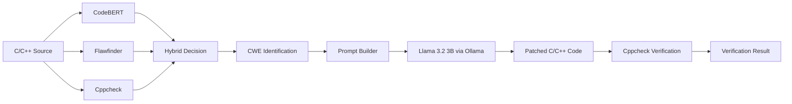

# VulnScan

> Automated C/C++ Vulnerability Detection & AI-Assisted Patching

VulnScan is an end-to-end security analysis tool that combines machine-learning-based detection, static analysis, and local LLM patch generation to identify vulnerabilities in C/C++ source code and generate safer replacements.

## ✨ Features

- **CodeBERT vulnerability classification** using `mrm8488/codebert-base-finetuned-detect-insecure-code`
- **Flawfinder** static security analysis
- **Cppcheck** static analysis
- **Hybrid vulnerability decision** combining ML and static-analysis evidence
- **CWE identification** from static-analysis findings
- **Local LLM patch generation** using Ollama and `llama3.2:3b`
- **Patch verification** using Cppcheck
- **Streamlit web interface**
- Supports **C, C++, and header files**

## 🧠 Architecture



### Pipeline

1. **Input** — Upload or paste C/C++ source.
2. **Detection** — CodeBERT predicts whether the code is vulnerable.
3. **Static Analysis** — Flawfinder and Cppcheck provide additional evidence.
4. **Hybrid Decision** — ML and static-analysis results are combined.
5. **CWE Identification** — Relevant CWE identifiers are extracted from findings.
6. **Patch Generation** — A structured prompt is sent to local Llama 3.2 3B through Ollama.
7. **Verification** — The generated patch is checked with Cppcheck.
8. **Report** — The UI displays the vulnerability analysis, patch, changes, and verification result.

## 🛠 Tech Stack

| Component | Technology |
|---|---|
| UI | Streamlit |
| ML Detection | Hugging Face Transformers + CodeBERT |
| Static Analysis | Flawfinder |
| Static Analysis | Cppcheck |
| LLM Patching | Ollama + Llama 3.2 3B |
| Language | Python |
| Target Languages | C / C++ |

## 📁 Project Structure

```text
vulnscan/
├── app.py
├── main.py
├── detector.py
├── prompt_builder.py
├── patcher.py
├── verifier.py
├── requirements.txt
├── samples/
│   └── vulnerable_buffer.c
├── docs/
│   └── screenshots/
└── README.md
```

## 🚀 Setup

### 1. Clone the repository

```bash
git clone https://github.com/<YOUR_USERNAME>/vulnscan.git
cd vulnscan
```

### 2. Create a virtual environment

Windows:

```powershell
python -m venv .venv
.venv\Scripts\activate
```

macOS/Linux:

```bash
python3 -m venv .venv
source .venv/bin/activate
```

### 3. Install Python dependencies

```bash
pip install -r requirements.txt
```

### 4. Install required system tools

VulnScan requires:

- Python 3.10+
- Flawfinder
- Cppcheck
- Ollama

Verify them:

```bash
flawfinder --version
cppcheck --version
ollama --version
```

### 5. Download the LLM

```bash
ollama pull llama3.2:3b
```

Make sure Ollama is running before using the patching stage.

### 6. Run the application

```bash
streamlit run app.py
```

Then open the local URL shown by Streamlit, usually:

```text
http://localhost:8501
```

## 🧪 Example

A vulnerable example is included in:

```text
samples/vulnerable_buffer.c
```

It intentionally demonstrates unsafe input handling and an unchecked string copy.

Run VulnScan, upload the file, and click **Analyze & Patch**.

The expected flow is:

```text
Vulnerable Code
      ↓
CodeBERT Detection
      ↓
Flawfinder + Cppcheck
      ↓
CWE Identification
      ↓
Llama 3.2 3B
      ↓
Generated Patch
      ↓
Cppcheck Verification
```

## ⚠️ Notes

- The first CodeBERT execution may download the Hugging Face model.
- Llama 3.2 3B runs locally through Ollama; model availability and inference speed depend on your machine.
- Static-analysis findings are used as supporting evidence for the hybrid decision.
- Patch verification currently uses Cppcheck-based validation and checks for remaining CWE-120 indicators.
- Generated LLM output should be treated as a candidate patch and reviewed before production use.

## 📸 Screenshots

Add application screenshots under:

```text
docs/screenshots/
```

Recommended screenshots:

1. `dashboard.png` — input screen
2. `analysis.png` — vulnerability detection results
3. `patch-verification.png` — generated patch and verification result

## 🔮 Future Improvements

- AST-based vulnerability localization
- More comprehensive CWE mapping
- Compiler-based patch validation
- Multi-language C/C++ test suite
- Patch diff generation
- Automated regression testing
- Additional vulnerability classes
- Quantitative evaluation across benchmark datasets

## 👨‍💻 Author

**Raj**

Built as a C/C++ security research and engineering project.
